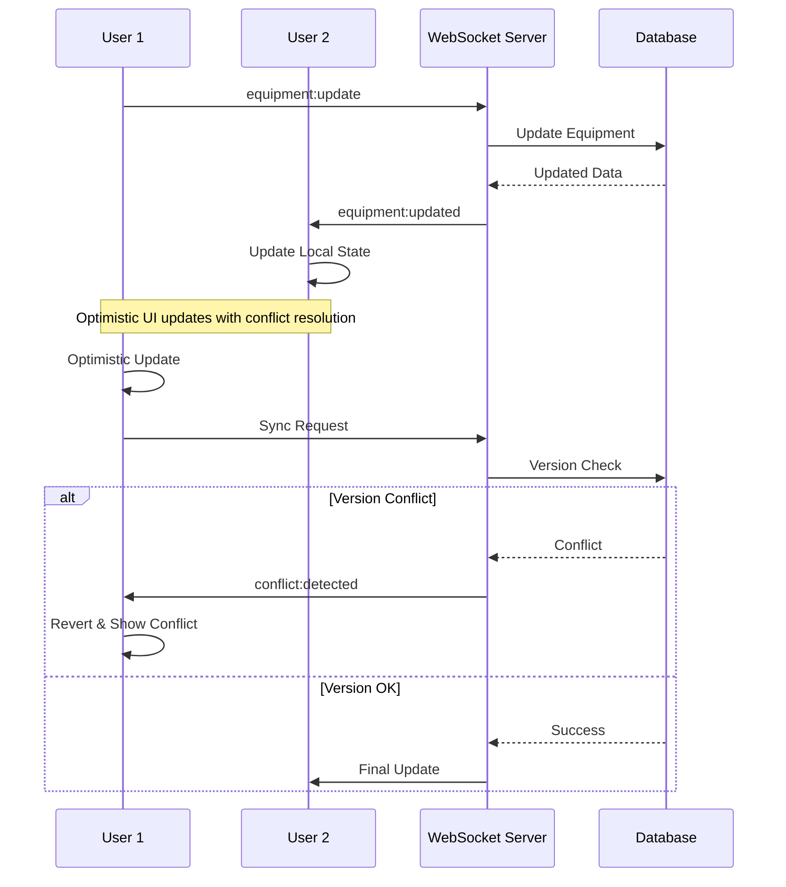

# AV-RENTALS System Architecture

<div align="center">
  
  
  
  
</div>

<br />

This document provides a comprehensive overview of the AV-RENTALS system architecture, including system design, database schema, security model, and scalability considerations. The architecture follows modern best practices for enterprise-grade applications with real-time collaboration capabilities.

## 📋 Table of Contents

- [System Overview](#-system-overview)
- [Architecture Patterns](#-architecture-patterns)
- [Technology Stack](#-technology-stack)
- [Database Architecture](#-database-architecture)
- [API Design](#-api-design)
- [Real-time Architecture](#-real-time-architecture)
- [Security Architecture](#-security-architecture)
- [Performance & Scalability](#-performance--scalability)
- [Deployment Architecture](#-deployment-architecture)
- [Data Flow](#-data-flow)

## 🏗️ System Overview

### High-Level Architecture


### Core Components

#### Frontend Layer
- **Progressive Web App**: React-based SPA with offline capabilities
- **State Management**: Context API with optimized re-rendering
- **UI Framework**: Tailwind CSS with Radix UI components
- **Real-time**: Socket.IO client for live updates

#### Backend Layer
- **API Server**: Next.js API routes with serverless architecture
- **Real-time Server**: Socket.IO for live collaboration
- **Database ORM**: Prisma with type-safe queries
- **Authentication**: JWT-based stateless authentication

#### Data Layer
- **Primary Database**: PostgreSQL for production, SQLite for development
- **Caching**: Redis for session storage and query caching
- **File Storage**: Local filesystem with cloud migration ready

## 🎯 Architecture Patterns

### 1. Layered Architecture

```
┌─────────────────────────────────────┐
│          Presentation Layer         │  ← React Components, UI
├─────────────────────────────────────┤
│          Application Layer          │  ← Business Logic, Services
├─────────────────────────────────────┤
│             Data Layer              │  ← Repository Pattern, ORM
├─────────────────────────────────────┤
│        Infrastructure Layer         │  ← Database, External APIs
└─────────────────────────────────────┘
```

### 2. Repository Pattern

```typescript
// Abstract repository interface
interface EquipmentRepository {
  findAll(filters?: EquipmentFilters): Promise<EquipmentItem[]>;
  findById(id: string): Promise<EquipmentItem | null>;
  create(data: CreateEquipmentData): Promise<EquipmentItem>;
  update(id: string, data: UpdateEquipmentData): Promise<EquipmentItem>;
  delete(id: string): Promise<void>;
}

// Prisma implementation
class PrismaEquipmentRepository implements EquipmentRepository {
  constructor(private prisma: PrismaClient) {}
  
  async findAll(filters?: EquipmentFilters): Promise<EquipmentItem[]> {
    return this.prisma.equipmentItem.findMany({
      where: this.buildWhereClause(filters),
      include: { category: true, subcategory: true }
    });
  }
}
```

### 3. Service Layer Pattern

```typescript
// Equipment service with business logic
class EquipmentService {
  constructor(
    private equipmentRepo: EquipmentRepository,
    private auditService: AuditService,
    private realtimeService: RealtimeService
  ) {}
  
  async createEquipment(data: CreateEquipmentData, userId: string): Promise<EquipmentItem> {
    // Validate business rules
    await this.validateEquipmentData(data);
    
    // Create equipment
    const equipment = await this.equipmentRepo.create(data);
    
    // Log audit trail
    await this.auditService.logAction('equipment:created', equipment.id, userId);
    
    // Notify real-time clients
    this.realtimeService.broadcast('equipment:created', equipment);
    
    return equipment;
  }
}
```

### 4. Command Query Responsibility Segregation (CQRS)

```typescript
// Command handlers for write operations
class CreateEquipmentCommand {
  constructor(public readonly data: CreateEquipmentData) {}
}

class CreateEquipmentHandler {
  async handle(command: CreateEquipmentCommand): Promise<EquipmentItem> {
    // Business logic and validation
    // Write to database
    // Emit events
  }
}

// Query handlers for read operations
class GetEquipmentQuery {
  constructor(public readonly filters: EquipmentFilters) {}
}

class GetEquipmentHandler {
  async handle(query: GetEquipmentQuery): Promise<EquipmentItem[]> {
    // Optimized read queries
    // Caching strategies
  }
}
```

## 💾 Database Architecture

### Entity Relationship Diagram


### Database Schema Design Principles

#### 1. Normalization
- **3rd Normal Form**: Eliminates data redundancy and update anomalies
- **Strategic Denormalization**: For frequently accessed computed values
- **Audit Trail**: Complete history of all changes

#### 2. Indexing Strategy
```sql
-- Primary performance indexes
CREATE INDEX idx_equipment_category ON equipment_items(category_id);
CREATE INDEX idx_equipment_status ON equipment_items(status);
CREATE INDEX idx_rental_event ON rentals(event_id);
CREATE INDEX idx_rental_equipment ON rentals(equipment_id);
CREATE INDEX idx_event_date_range ON events(start_date, end_date);

-- Composite indexes for complex queries
CREATE INDEX idx_equipment_search ON equipment_items(status, category_id, name);
CREATE INDEX idx_rental_availability ON rentals(equipment_id, event_id);

-- Full-text search indexes
CREATE INDEX idx_equipment_fulltext ON equipment_items USING gin(to_tsvector('english', name || ' ' || description));
```

#### 3. Data Integrity Constraints
```sql
-- Referential integrity
ALTER TABLE rentals ADD CONSTRAINT fk_rental_event 
    FOREIGN KEY (event_id) REFERENCES events(id) ON DELETE CASCADE;

-- Business rule constraints
ALTER TABLE equipment_items ADD CONSTRAINT chk_quantity_positive 
    CHECK (quantity >= 0);

ALTER TABLE rentals ADD CONSTRAINT chk_quantity_rented_positive 
    CHECK (quantity_rented > 0);

-- Unique constraints
ALTER TABLE users ADD CONSTRAINT uk_user_username UNIQUE (username);
ALTER TABLE users ADD CONSTRAINT uk_user_email UNIQUE (email);
```

### Data Models

#### Core Entity Models

```typescript
// User Management
interface User {
  id: string;
  username: string;
  email: string;
  passwordHash: string;
  role: UserRole;
  isActive: boolean;
  profile?: UserProfile;
  createdAt: Date;
  updatedAt: Date;
  version: number;
}

interface UserProfile {
  id: string;
  userId: string;
  firstName: string;
  lastName: string;
  phone?: string;
  avatar?: string;
}

// Equipment Management
interface EquipmentItem {
  id: string;
  name: string;
  description: string;
  categoryId: string;
  subcategoryId?: string;
  quantity: number;
  status: EquipmentStatus;
  location: string;
  dailyRate: number;
  type: EquipmentType;
  imageUrl?: string;
  category: Category;
  subcategory?: Subcategory;
  maintenanceLogs: MaintenanceLog[];
  createdAt: Date;
  updatedAt: Date;
  version: number;
}

// Event and Rental Management
interface Event {
  id: string;
  name: string;
  clientId: string;
  location: string;
  startDate: Date;
  endDate: Date;
  notes?: string;
  client: Client;
  rentals: Rental[];
  quotes: Quote[];
  createdAt: Date;
  updatedAt: Date;
}

interface Rental {
  id: string;
  eventId: string;
  equipmentId: string;
  quantityRented: number;
  prepStatus: RentalPrepStatus;
  notes?: string;
  event: Event;
  equipment: EquipmentItem;
  createdAt: Date;
  updatedAt: Date;
}
```

#### Audit and Versioning Models

```typescript
interface AuditLog {
  id: string;
  userId: string;
  action: string;
  entityType: string;
  entityId: string;
  oldValues?: Record<string, any>;
  newValues?: Record<string, any>;
  ipAddress?: string;
  userAgent?: string;
  timestamp: Date;
}

interface VersionedEntity {
  version: number;
  updatedAt: Date;
  updatedBy: string;
}
```

## 🔌 API Design

### RESTful API Architecture

#### 1. Resource-Based URLs
```
GET    /api/equipment           # List equipment
POST   /api/equipment           # Create equipment
GET    /api/equipment/:id       # Get specific equipment
PUT    /api/equipment/:id       # Update equipment
DELETE /api/equipment/:id       # Delete equipment

GET    /api/rentals             # List rentals
POST   /api/rentals             # Create rental
PUT    /api/rentals/:id         # Update rental
DELETE /api/rentals/:id         # Delete rental
```

#### 2. HTTP Status Codes
```typescript
// Success responses
200: OK                    // Successful GET, PUT
201: Created              // Successful POST
204: No Content          // Successful DELETE

// Client errors
400: Bad Request         // Invalid request data
401: Unauthorized        // Missing/invalid authentication
403: Forbidden          // Insufficient permissions
404: Not Found          // Resource doesn't exist
409: Conflict           // Business rule violation
422: Unprocessable Entity // Validation errors

// Server errors
500: Internal Server Error // Unexpected server error
503: Service Unavailable  // Temporary server issue
```

#### 3. Request/Response Format
```typescript
// Standardized API response
interface APIResponse<T> {
  success: boolean;
  data?: T;
  error?: string;
  code?: string;
  details?: Record<string, any>;
  pagination?: {
    page: number;
    pageSize: number;
    total: number;
    totalPages: number;
  };
  timestamp: string;
}

// Error response format
interface APIError {
  error: string;
  code: string;
  details?: Record<string, any>;
  timestamp: string;
}
```

#### 4. Input Validation with Zod

```typescript
import { z } from 'zod';

// Equipment validation schema
const EquipmentSchema = z.object({
  name: z.string().min(1).max(100),
  description: z.string().min(1).max(500),
  categoryId: z.string().uuid(),
  subcategoryId: z.string().uuid().optional(),
  quantity: z.number().int().min(0),
  status: z.enum(['good', 'damaged', 'maintenance']),
  location: z.string().min(1).max(100),
  dailyRate: z.number().positive(),
  type: z.enum(['equipment', 'consumable']),
});

// API endpoint with validation
export async function POST(request: NextRequest) {
  try {
    const body = await request.json();
    const validatedData = EquipmentSchema.parse(body);
    
    // Process valid data
    const equipment = await equipmentService.create(validatedData);
    
    return NextResponse.json({
      success: true,
      data: equipment,
      timestamp: new Date().toISOString()
    }, { status: 201 });
    
  } catch (error) {
    if (error instanceof z.ZodError) {
      return NextResponse.json({
        error: 'Validation failed',
        code: 'VALIDATION_ERROR',
        details: error.errors,
        timestamp: new Date().toISOString()
      }, { status: 400 });
    }
    
    return NextResponse.json({
      error: 'Internal server error',
      code: 'INTERNAL_ERROR',
      timestamp: new Date().toISOString()
    }, { status: 500 });
  }
}
```

## ⚡ Real-time Architecture

### Socket.IO Implementation

#### 1. Server-Side Event Handling

```typescript
// socket-server.ts
import { Server } from 'socket.io';
import { authenticateSocket } from './auth-middleware';

class RealtimeServer {
  private io: Server;
  
  constructor() {
    this.io = new Server({
      cors: { origin: process.env.NEXT_PUBLIC_APP_URL },
    });
    
    this.setupMiddleware();
    this.setupEventHandlers();
  }
  
  private setupMiddleware() {
    this.io.use(authenticateSocket);
  }
  
  private setupEventHandlers() {
    this.io.on('connection', (socket) => {
      console.log(`User ${socket.data.userId} connected`);
      
      // Join user-specific room
      socket.join(`user:${socket.data.userId}`);
      
      // Equipment events
      socket.on('equipment:update', this.handleEquipmentUpdate.bind(this));
      socket.on('equipment:view', this.handleEquipmentView.bind(this));
      
      // Rental events
      socket.on('rental:create', this.handleRentalCreate.bind(this));
      socket.on('rental:update', this.handleRentalUpdate.bind(this));
      
      // User activity tracking
      socket.on('user:activity', this.handleUserActivity.bind(this));
      
      socket.on('disconnect', () => {
        console.log(`User ${socket.data.userId} disconnected`);
      });
    });
  }
  
  // Broadcast equipment updates to all clients
  broadcastEquipmentUpdate(equipment: EquipmentItem, excludeUser?: string) {
    this.io.emit('equipment:updated', {
      equipment,
      timestamp: new Date().toISOString(),
      updatedBy: excludeUser
    });
  }
  
  // Send conflict notifications
  notifyRentalConflict(rental: Rental, conflictingUsers: string[]) {
    conflictingUsers.forEach(userId => {
      this.io.to(`user:${userId}`).emit('rental:conflict', {
        rental,
        message: 'Equipment conflict detected',
        timestamp: new Date().toISOString()
      });
    });
  }
}
```

#### 2. Client-Side Real-time Integration

```typescript
// useRealtime.ts
import { useEffect, useContext } from 'react';
import { io, Socket } from 'socket.io-client';
import { useAuth } from './useAuth';
import { AppContext } from '../contexts/AppContext';

export function useRealtime() {
  const { user, token } = useAuth();
  const { dispatch } = useContext(AppContext);
  
  useEffect(() => {
    if (!user || !token) return;
    
    const socket: Socket = io(process.env.NEXT_PUBLIC_SOCKET_URL!, {
      auth: { token }
    });
    
    // Equipment real-time events
    socket.on('equipment:updated', (data) => {
      dispatch({ type: 'UPDATE_EQUIPMENT', payload: data.equipment });
      showNotification(`Equipment ${data.equipment.name} was updated`);
    });
    
    socket.on('equipment:created', (data) => {
      dispatch({ type: 'ADD_EQUIPMENT', payload: data.equipment });
      showNotification(`New equipment ${data.equipment.name} added`);
    });
    
    socket.on('equipment:deleted', (data) => {
      dispatch({ type: 'REMOVE_EQUIPMENT', payload: data.id });
      showNotification(`Equipment was deleted`);
    });
    
    // Rental real-time events
    socket.on('rental:conflict', (data) => {
      showConflictNotification(data.rental, data.message);
    });
    
    socket.on('rental:updated', (data) => {
      dispatch({ type: 'UPDATE_RENTAL', payload: data.rental });
    });
    
    // User activity indicators
    socket.on('user:activity', (data) => {
      dispatch({ type: 'UPDATE_USER_ACTIVITY', payload: data });
    });
    
    return () => {
      socket.disconnect();
    };
  }, [user, token, dispatch]);
}
```

#### 3. Optimistic Locking Implementation

```typescript
// optimistic-locking.ts
class OptimisticLockService {
  async updateWithLock<T extends VersionedEntity>(
    id: string,
    data: Partial<T>,
    expectedVersion: number,
    updateFn: (id: string, data: Partial<T>) => Promise<T>
  ): Promise<T> {
    try {
      const updatedEntity = await updateFn(id, {
        ...data,
        version: expectedVersion + 1
      });
      
      return updatedEntity;
    } catch (error) {
      if (error instanceof PrismaClientKnownRequestError && error.code === 'P2025') {
        throw new ConflictError('Entity was modified by another user');
      }
      throw error;
    }
  }
}

// Usage in equipment service
class EquipmentService {
  async updateEquipment(
    id: string, 
    data: UpdateEquipmentData, 
    expectedVersion: number
  ): Promise<EquipmentItem> {
    return this.lockService.updateWithLock(
      id,
      data,
      expectedVersion,
      async (id, updateData) => {
        return this.prisma.equipmentItem.update({
          where: { 
            id,
            version: expectedVersion // Optimistic lock check
          },
          data: updateData,
          include: { category: true, subcategory: true }
        });
      }
    );
  }
}
```

## 🔐 Security Architecture

### 1. Authentication & Authorization

#### JWT-Based Authentication
```typescript
// auth.service.ts
import jwt from 'jsonwebtoken';
import bcrypt from 'bcryptjs';

interface JWTPayload {
  userId: string;
  username: string;
  role: UserRole;
  iat: number;
  exp: number;
}

class AuthService {
  private readonly jwtSecret = process.env.JWT_SECRET!;
  private readonly jwtExpiry = '24h';
  
  async login(username: string, password: string): Promise<LoginResponse> {
    // Find user
    const user = await this.userRepository.findByUsername(username);
    if (!user || !user.isActive) {
      throw new UnauthorizedError('Invalid credentials');
    }
    
    // Verify password
    const isValidPassword = await bcrypt.compare(password, user.passwordHash);
    if (!isValidPassword) {
      throw new UnauthorizedError('Invalid credentials');
    }
    
    // Generate JWT token
    const payload: JWTPayload = {
      userId: user.id,
      username: user.username,
      role: user.role,
      iat: Math.floor(Date.now() / 1000),
      exp: Math.floor(Date.now() / 1000) + (24 * 60 * 60), // 24 hours
    };
    
    const token = jwt.sign(payload, this.jwtSecret);
    
    // Log login
    await this.auditService.logLogin(user.id);
    
    return {
      token,
      user: this.sanitizeUser(user),
      expiresIn: this.jwtExpiry
    };
  }
  
  async verifyToken(token: string): Promise<JWTPayload> {
    try {
      return jwt.verify(token, this.jwtSecret) as JWTPayload;
    } catch (error) {
      throw new UnauthorizedError('Invalid token');
    }
  }
}
```

#### Role-Based Access Control (RBAC)
```typescript
// authorization.middleware.ts
type Permission = 
  | 'equipment:read' | 'equipment:write' | 'equipment:delete'
  | 'rental:read' | 'rental:write' | 'rental:delete'
  | 'client:read' | 'client:write' | 'client:delete'
  | 'user:read' | 'user:write' | 'user:delete'
  | 'admin:full';

const ROLE_PERMISSIONS: Record<UserRole, Permission[]> = {
  Admin: ['admin:full'],
  Manager: [
    'equipment:read', 'equipment:write', 'equipment:delete',
    'rental:read', 'rental:write', 'rental:delete',
    'client:read', 'client:write', 'client:delete',
    'user:read'
  ],
  Technician: [
    'equipment:read', 'equipment:write',
    'rental:read', 'rental:write',
    'client:read'
  ],
  Employee: [
    'equipment:read',
    'rental:read', 'rental:write',
    'client:read', 'client:write'
  ],
  Viewer: [
    'equipment:read',
    'rental:read',
    'client:read'
  ]
};

function requirePermission(permission: Permission) {
  return (req: AuthenticatedRequest, res: Response, next: NextFunction) => {
    const userRole = req.user.role;
    const userPermissions = ROLE_PERMISSIONS[userRole];
    
    if (userPermissions.includes('admin:full') || userPermissions.includes(permission)) {
      next();
    } else {
      res.status(403).json({
        error: 'Insufficient permissions',
        code: 'FORBIDDEN',
        timestamp: new Date().toISOString()
      });
    }
  };
}
```

### 2. Input Validation & Sanitization

```typescript
// validation.middleware.ts
import { z } from 'zod';
import DOMPurify from 'isomorphic-dompurify';

// Sanitize HTML input to prevent XSS
function sanitizeHtml(input: string): string {
  return DOMPurify.sanitize(input);
}

// SQL injection prevention through Prisma
// Prisma automatically parameterizes queries, preventing SQL injection

// XSS prevention in API responses
function sanitizeResponse<T>(data: T): T {
  if (typeof data === 'string') {
    return sanitizeHtml(data) as T;
  }
  if (Array.isArray(data)) {
    return data.map(sanitizeResponse) as T;
  }
  if (typeof data === 'object' && data !== null) {
    const sanitized: Record<string, any> = {};
    for (const [key, value] of Object.entries(data)) {
      sanitized[key] = sanitizeResponse(value);
    }
    return sanitized as T;
  }
  return data;
}
```

### 3. Rate Limiting & DDoS Protection

```typescript
// rate-limiting.middleware.ts
import { RateLimiterRedis } from 'rate-limiter-flexible';
import Redis from 'ioredis';

const redis = new Redis(process.env.REDIS_URL);

// Different rate limits for different operations
const authLimiter = new RateLimiterRedis({
  storeClient: redis,
  keyPrefix: 'auth_limit',
  points: 5, // Number of attempts
  duration: 900, // Per 15 minutes
  blockDuration: 900, // Block for 15 minutes
});

const apiLimiter = new RateLimiterRedis({
  storeClient: redis,
  keyPrefix: 'api_limit',
  points: 100, // Number of requests
  duration: 60, // Per minute
  blockDuration: 60, // Block for 1 minute
});

const uploadLimiter = new RateLimiterRedis({
  storeClient: redis,
  keyPrefix: 'upload_limit',
  points: 5, // Number of uploads
  duration: 60, // Per minute
  blockDuration: 300, // Block for 5 minutes
});

export function createRateLimiter(limiter: RateLimiterRedis) {
  return async (req: Request, res: Response, next: NextFunction) => {
    const key = req.ip || 'unknown';
    
    try {
      await limiter.consume(key);
      next();
    } catch (rateLimiterRes) {
      const secs = Math.round(rateLimiterRes.msBeforeNext / 1000) || 1;
      res.set('Retry-After', String(secs));
      res.status(429).json({
        error: 'Too many requests',
        code: 'RATE_LIMITED',
        retryAfter: secs,
        timestamp: new Date().toISOString()
      });
    }
  };
}
```

## 📈 Performance & Scalability

### 1. Database Optimization

#### Query Optimization
```typescript
// Optimized equipment queries with includes
const getEquipmentWithRelations = async (filters: EquipmentFilters) => {
  return prisma.equipmentItem.findMany({
    where: {
      ...(filters.status && { status: filters.status }),
      ...(filters.categoryId && { categoryId: filters.categoryId }),
      ...(filters.search && {
        OR: [
          { name: { contains: filters.search, mode: 'insensitive' } },
          { description: { contains: filters.search, mode: 'insensitive' } }
        ]
      })
    },
    include: {
      category: {
        select: { id: true, name: true, icon: true }
      },
      subcategory: {
        select: { id: true, name: true }
      },
      _count: {
        select: { rentals: true }
      }
    },
    orderBy: [
      { status: 'asc' },
      { name: 'asc' }
    ]
  });
};

// Pagination for large datasets
const getPaginatedEquipment = async (page: number, pageSize: number) => {
  const skip = (page - 1) * pageSize;
  
  const [items, total] = await Promise.all([
    prisma.equipmentItem.findMany({
      skip,
      take: pageSize,
      include: { category: true, subcategory: true }
    }),
    prisma.equipmentItem.count()
  ]);
  
  return {
    items,
    total,
    page,
    pageSize,
    totalPages: Math.ceil(total / pageSize)
  };
};
```

#### Connection Pooling
```typescript
// prisma/db.ts
import { PrismaClient } from '@prisma/client';

const globalForPrisma = globalThis as unknown as {
  prisma: PrismaClient | undefined;
};

export const prisma = globalForPrisma.prisma ?? new PrismaClient({
  datasources: {
    db: {
      url: process.env.DATABASE_URL
    }
  },
  log: process.env.NODE_ENV === 'development' ? ['query', 'error', 'warn'] : ['error'],
});

if (process.env.NODE_ENV !== 'production') globalForPrisma.prisma = prisma;
```

### 2. Caching Strategy

#### Redis Caching
```typescript
// cache.service.ts
import Redis from 'ioredis';

class CacheService {
  private redis: Redis;
  
  constructor() {
    this.redis = new Redis(process.env.REDIS_URL!);
  }
  
  async get<T>(key: string): Promise<T | null> {
    const cached = await this.redis.get(key);
    return cached ? JSON.parse(cached) : null;
  }
  
  async set(key: string, value: any, ttlSeconds = 3600): Promise<void> {
    await this.redis.setex(key, ttlSeconds, JSON.stringify(value));
  }
  
  async invalidate(pattern: string): Promise<void> {
    const keys = await this.redis.keys(pattern);
    if (keys.length > 0) {
      await this.redis.del(...keys);
    }
  }
  
  // Cache equipment lists with smart invalidation
  async getCachedEquipment(filters: EquipmentFilters): Promise<EquipmentItem[] | null> {
    const cacheKey = `equipment:${JSON.stringify(filters)}`;
    return this.get<EquipmentItem[]>(cacheKey);
  }
  
  async setCachedEquipment(filters: EquipmentFilters, equipment: EquipmentItem[]): Promise<void> {
    const cacheKey = `equipment:${JSON.stringify(filters)}`;
    await this.set(cacheKey, equipment, 300); // 5 minutes
  }
  
  async invalidateEquipmentCache(): Promise<void> {
    await this.invalidate('equipment:*');
  }
}
```

#### Application-Level Caching
```typescript
// In-memory cache for frequently accessed data
class InMemoryCache {
  private cache = new Map<string, { data: any; expiry: number }>();
  
  get<T>(key: string): T | null {
    const item = this.cache.get(key);
    if (!item) return null;
    
    if (Date.now() > item.expiry) {
      this.cache.delete(key);
      return null;
    }
    
    return item.data;
  }
  
  set(key: string, data: any, ttlMs = 60000): void {
    this.cache.set(key, {
      data,
      expiry: Date.now() + ttlMs
    });
  }
  
  invalidate(key: string): void {
    this.cache.delete(key);
  }
  
  clear(): void {
    this.cache.clear();
  }
}
```

### 3. Horizontal Scaling

#### Load Balancing Configuration
```nginx
# nginx.conf
upstream app_servers {
    least_conn;
    server app1:3000 weight=1 max_fails=3 fail_timeout=30s;
    server app2:3000 weight=1 max_fails=3 fail_timeout=30s;
    server app3:3000 weight=1 max_fails=3 fail_timeout=30s;
}

server {
    listen 80;
    server_name acrobaticzrental.duckdns.org;
    
    location / {
        proxy_pass http://app_servers;
        proxy_set_header Host $host;
        proxy_set_header X-Real-IP $remote_addr;
        proxy_set_header X-Forwarded-For $proxy_add_x_forwarded_for;
        proxy_set_header X-Forwarded-Proto $scheme;
        
        # Enable sticky sessions for Socket.IO
        proxy_set_header Upgrade $http_upgrade;
        proxy_set_header Connection "upgrade";
        proxy_http_version 1.1;
    }
}
```

#### Auto-scaling with Docker Swarm
```yaml
# docker-compose.prod.yml
version: '3.8'
services:
  app:
    image: av-rentals:latest
    deploy:
      replicas: 3
      update_config:
        parallelism: 1
        delay: 10s
      restart_policy:
        condition: on-failure
        delay: 5s
        max_attempts: 3
    environment:
      - DATABASE_URL=${DATABASE_URL}
      - REDIS_URL=${REDIS_URL}
    depends_on:
      - database
      - redis
      
  database:
    image: postgres:15
    deploy:
      replicas: 1
      placement:
        constraints: [node.role == manager]
    environment:
      - POSTGRES_DB=${POSTGRES_DB}
      - POSTGRES_USER=${POSTGRES_USER}
      - POSTGRES_PASSWORD=${POSTGRES_PASSWORD}
    volumes:
      - postgres_data:/var/lib/postgresql/data
      
  redis:
    image: redis:7-alpine
    deploy:
      replicas: 1
    command: redis-server --appendonly yes
    volumes:
      - redis_data:/data
```

## 🚀 Deployment Architecture

### Production Deployment Topology


### Environment Configuration

#### Development Environment
```yaml
# docker-compose.dev.yml
version: '3.8'
services:
  app:
    build:
      context: .
      target: development
    ports:
      - "3000:3000"
    environment:
      - NODE_ENV=development
      - DATABASE_URL=file:./dev.db
    volumes:
      - .:/app
      - node_modules:/app/node_modules
    command: npm run dev
```

#### Production Environment
```yaml
# docker-compose.prod.yml
version: '3.8'
services:
  app:
    image: av-rentals:${VERSION}
    environment:
      - NODE_ENV=production
      - DATABASE_URL=${DATABASE_URL}
      - JWT_SECRET=${JWT_SECRET}
      - REDIS_URL=${REDIS_URL}
    deploy:
      replicas: 3
      resources:
        limits:
          memory: 512M
          cpus: '0.5'
        reservations:
          memory: 256M
          cpus: '0.25'
```

## 📊 Data Flow

### Equipment Management Flow


### Rental Conflict Detection Flow


### Real-time Synchronization Flow



---

<div align="center">

### 🔗 Related Documentation

[📖 Main README](README.md) | [🚀 Deployment Guide](DEPLOYMENT.md) | [📚 API Documentation](API-DOCUMENTATION.md) | [🤝 Contributing](CONTRIBUTING.md)

**Complete System Architecture** • **Scalable Design** • **Enterprise Ready**

</div>